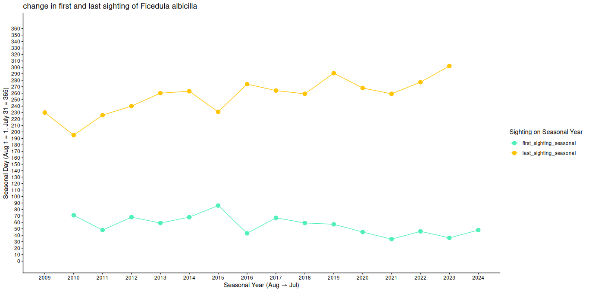
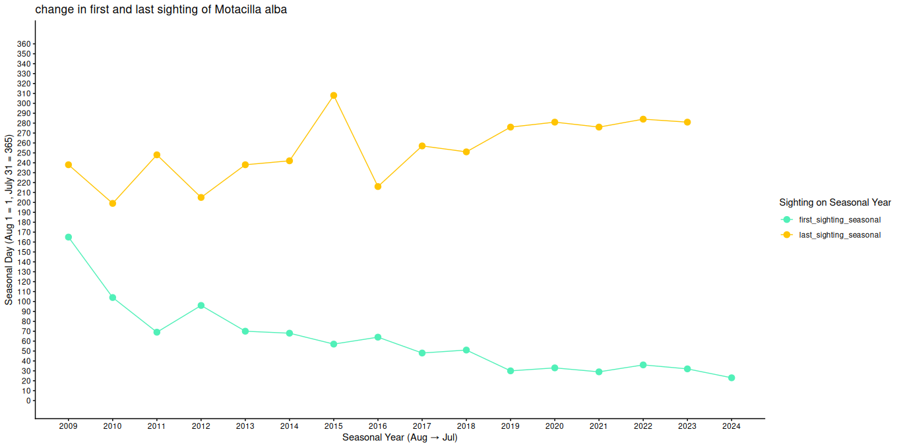
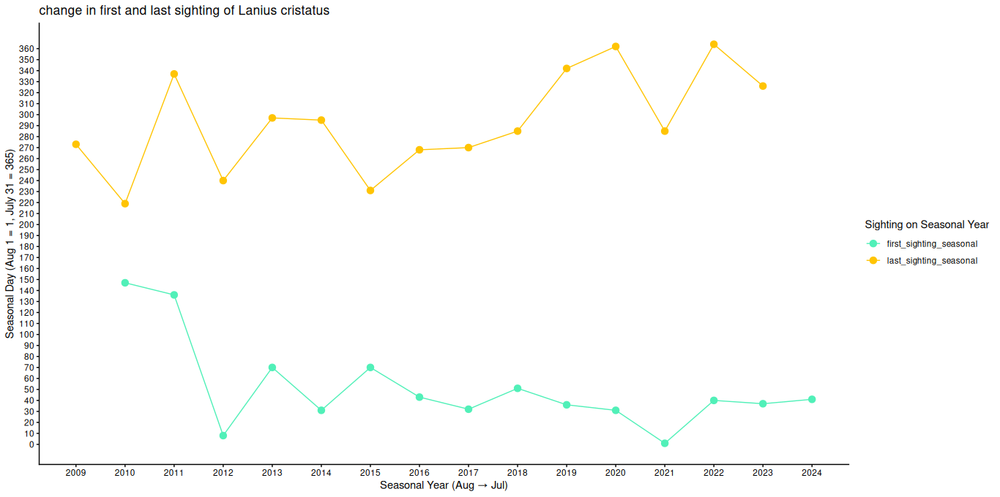
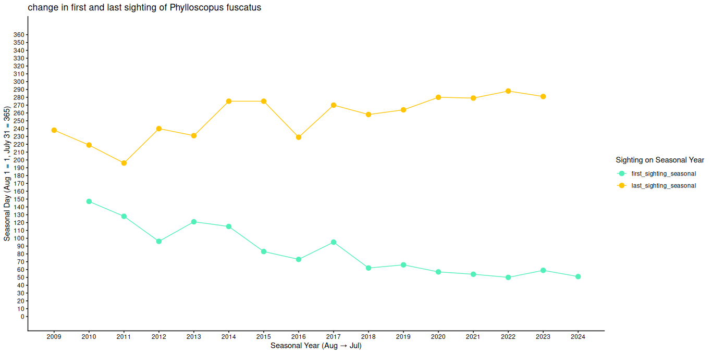
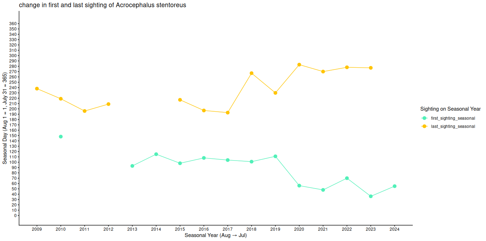
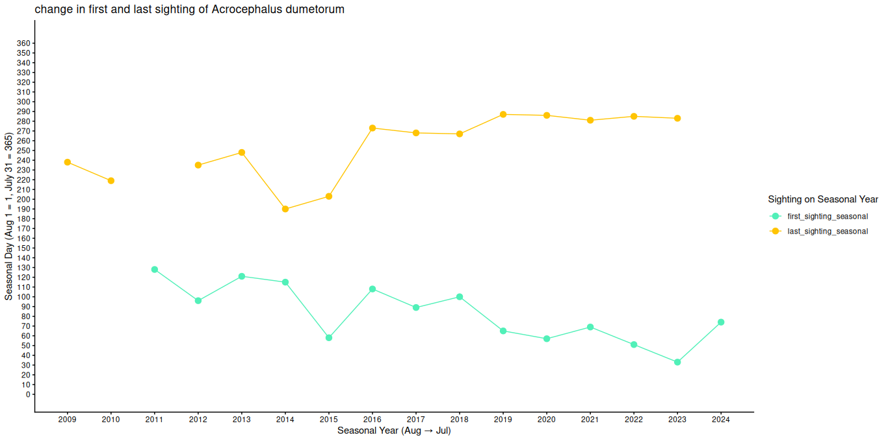
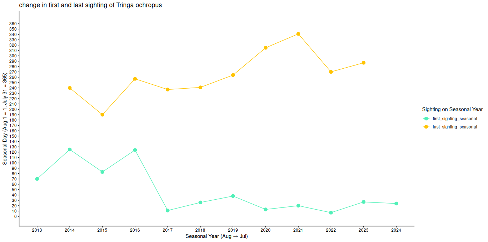

# Pilot Study on phenological shift in migration of selected migratory birds
This is a pilot study done by Avijit Dutta Borshon and Uzzal Das to assess whether there are any shift in migration timing of some selected migratory birds. The code and analysis is written by Avijit Dutta Borshon while, Uzzal Das gave the initial heads on about the topic and helped in selecting the species to study on.

## (1) Data Used
We downloaded eBird dataset of all birds in Bangladesh (2010-2024) from GBIF.
[GBIF dataset link](https://www.gbif.org/occurrence/download/0015493-250920141307145)

## (2) Selecting Bird Species for study
We have selected 7 common migratory birds that had enough occurrence data in eBird dataset for the pilot study. The selected species are,
- Taiga flycatcher (4168)
-  White Wagtail (4744)
-  Brown Shrike (3362)
-  Dusky Warbler (2292)
-  Clamorous Reed Warbler (621)
-  Blyth's Reed Warbler (1474)
-  Green Sandpiper (1194)

## (3) Analysis
We analyzed the shifts in first and last sighting of the birds from the year 2010 to 2024. Since migratory season of most birds overlap two years, we create a variable termed 'seasonal year' which starts at Aug 1 and ends at July 31 thereby avoiding confusion that may occur due to overlapping of the years in a migratory season.
Then, we calculated the seasonal first sighting and seasonal last sighting of the birds in the seasonal year and analyzed how these values shifted over the years.

The code for the analysis is given in the file [mg_bird.R](mg_bird.R)

## (4) Result
Across species, we observed a negative trend in the average timing of first seasonal sightings, indicating earlier arrival dates in recent years. Conversely, the timing of last seasonal sightings showed a positive trend, suggesting later departures. These information are summarized in the table below,

| Scientific name          | Common name              | Avg seasonal first sighting shift per year (days) | Avg seasonal last sighting shift per year (days) |
|--------------------------|--------------------------|--------------------------------------------|-------------------------------------------|
| *Ficedula albicilla*     | Taiga Flycatcher         | -1.643                                     | 5.143                                     |
| *Motacilla alba*         | White Wagtail            | -9.467                                     | 3.071                                     |
| *Lanius cristatus*       | Brown Shrike             | -7.571                                     | 3.786                                     |
| *Phylloscopus fuscatus*  | Dusky Warbler            | -6.857                                     | 3.071                                     |
| *Acrocephalus stentoreus*| Clamorous Reed Warbler   | -3.455                                     | 2.818                                     |
| *Acrocephalus dumetorum* | Blyth's Reed Warbler     | -4.154                                     | 2.417                                     |
| *Tringa ochropus*        | Green Sandpiper          | -4.182                                     | 5.222                                     |

The following plots show the trends in migration timing shifts for the selected species.
****
Ficedula albicilla (Taiga Flycatcher)

****
Motacilla alba (White Wagtail)

****
Lanius cristatus (Brown Shrike)

****
Phylloscopus fuscatus (Dusky Warbler)

****
Acrocephalus stentoreus (Clamorous Reed Warbler)

****
Acrocephalus dumetorum (Blyth's Reed Warbler)

****
Tringa ochropus (Green Sandpiper)

***

## (5) Conclusion
In conclusion, our results suggest that birds are arriving earlier and leaving later in recent years. Although the dataset is based on citizen science observations rather than structured surveys, it may be the only way to study shifts in migratory timing in Bangladesh and provide crucial information for conservation planning. In the future, we plan to incorporate data from social media to improve the accuracy of these analyses.

[For any info regarding the code and analysis, please contact with Avijit Dutta Borshon borshon0101@gmail.com]

