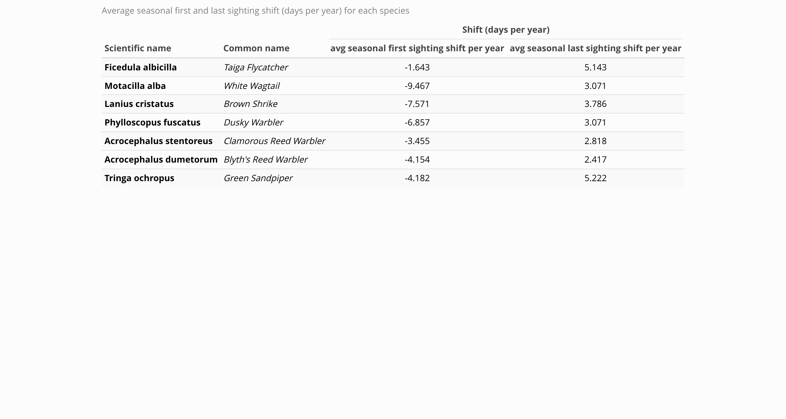

# Pilot Study on phenological shift in migration of selected migratory birds
This is a pilot study done by Avijit Dutta Borshon and Uzzal Das to assess whether there are any shift in migration timing of some selected migratory birds. The code and analysis is written by Avijit Dutta Borshon while, Uzzal Das gave the initial heads on about the topic and helped in selecting the species to study on.

## (1) Data Used
We downloaded eBird dataset of all birds in Bangladesh (2010-2024) from GBIF.
[GBIF dataset link](https://www.gbif.org/occurrence/download/0015493-250920141307145)

## (2) Selecting Bird Species for study
We have selected 7 common migratory birds that had enough occurrence data in eBird dataset for the pilot study. The selected species are,
- Taiga flycatcher (4168)
-  White Wagtail (4744)
-  Brown Shrike (3362)
-  Dusky Warbler (2292)
-  Clamorous Reed Warbler (621)
-  Blyth's Reed Warbler (1474)
-  Green Sandpiper (1194)

## (3) Analysis
We analyzed the shifts in first and last sighting of the birds from the year 2010 to 2024. Since migratory season of most birds overlap two years, we create a variable termed 'seasonal year' which starts at Aug 1 and ends at July 31 thereby avoiding confusion that may occur due to overlapping of the years in a migratory season.
Then, we calculated the seasonal first sighting and seasonal last sighting of the birds in the seasonal year and analyzed how these values shifted over the years.

## (4) Result
Across species, we observed a negative trend in the average timing of first seasonal sightings, indicating earlier arrival dates in recent years. Conversely, the timing of last seasonal sightings showed a positive trend, suggesting later departures. These information are summarized in the table below,

